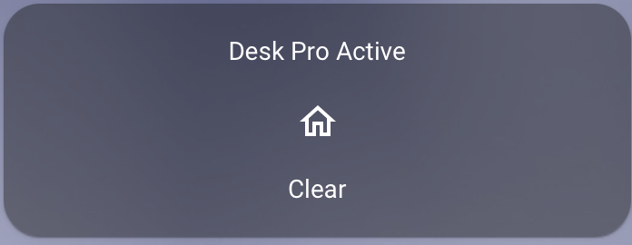
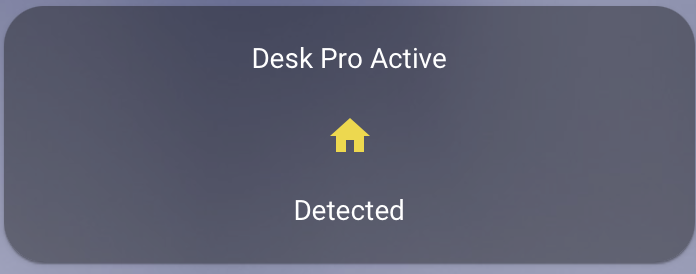

# Webex Call Status
## MQTT Bridge

This container will allow you to subscribe to call status events 
on a Webex Desk Pro (and possibly others, that's all I have). 

It will then send MQTT messages to a broker so that you can then 
take action based on whether or not your endpoint is in a call.

I built this specifically for use with Home Assistant and the instructions
will reflect that.

## Setup

You will need to have the API available on your endpoint. If your
endpoint is cloud managed, you'll need a local user.

Next you will need a basic auth token. You may find that 
[this](https://www.blitter.se/utils/basic-authentication-header-generator/) 
works for you to make one. If you worry about sending your password
to a random website, then make one via the method of your choice.

Finally, run the container.

## Running
``` bash
docker run -d --env DESKPRO_TOKEN=<token> \
    --env DESKPRO_IP=<ip> \
    --env MQTT_HOST=<host> \
    --env MQTT_PORT=<port> \
    --env MQTT_USERNAME=<username> \
    --env MQTT_PASSWORD=<password> \
    sluzynsk/webexstatus
```

## HomeAssistant
There are now MQTT messages flying at your HomeAssistant install. Right now there are two:
```text
webexDP/Available - True/False, use to see if the script is running. The script tries to set 
            itself unavailable on exit.
webexDP/InACall - True/False. True if you're in a call.
```

If you're in a call when you start the script, the status isn't going to update until you hang up.
This is because rather than querying for current status, we subscribe to status changes. 

You can at the very least create a status indicator to show your call status. In configuration.yaml:
```yaml
binary_sensor:
  - platform: mqtt
    name: "Desk Pro Active"
    state_topic: "webexDP/InACall"
    payload_on: "True"
    payload_off: "False"
    device_class: occupancy
```





More creative uses of the information would be to tie it to a light to indicate to your family to
not open the office door, for example.